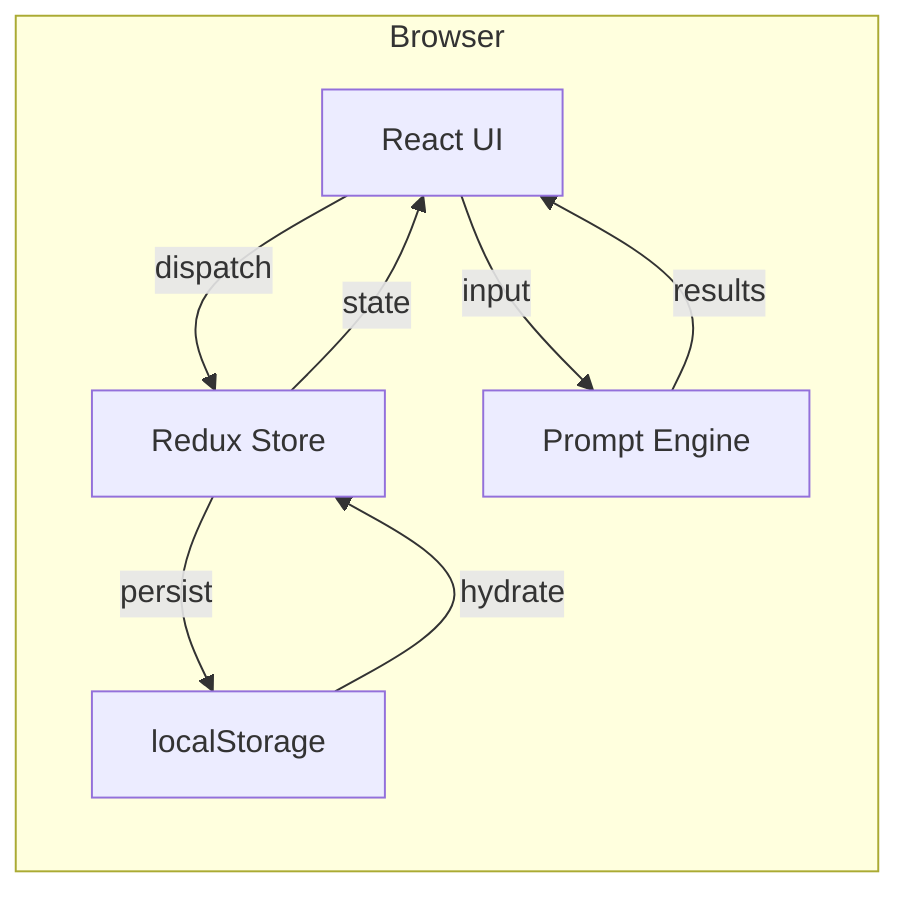
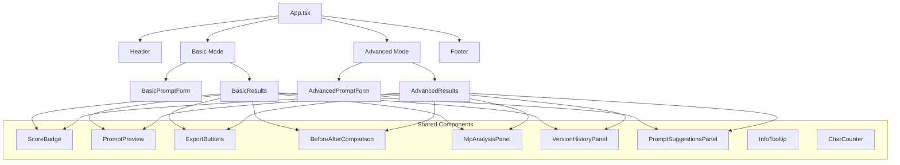
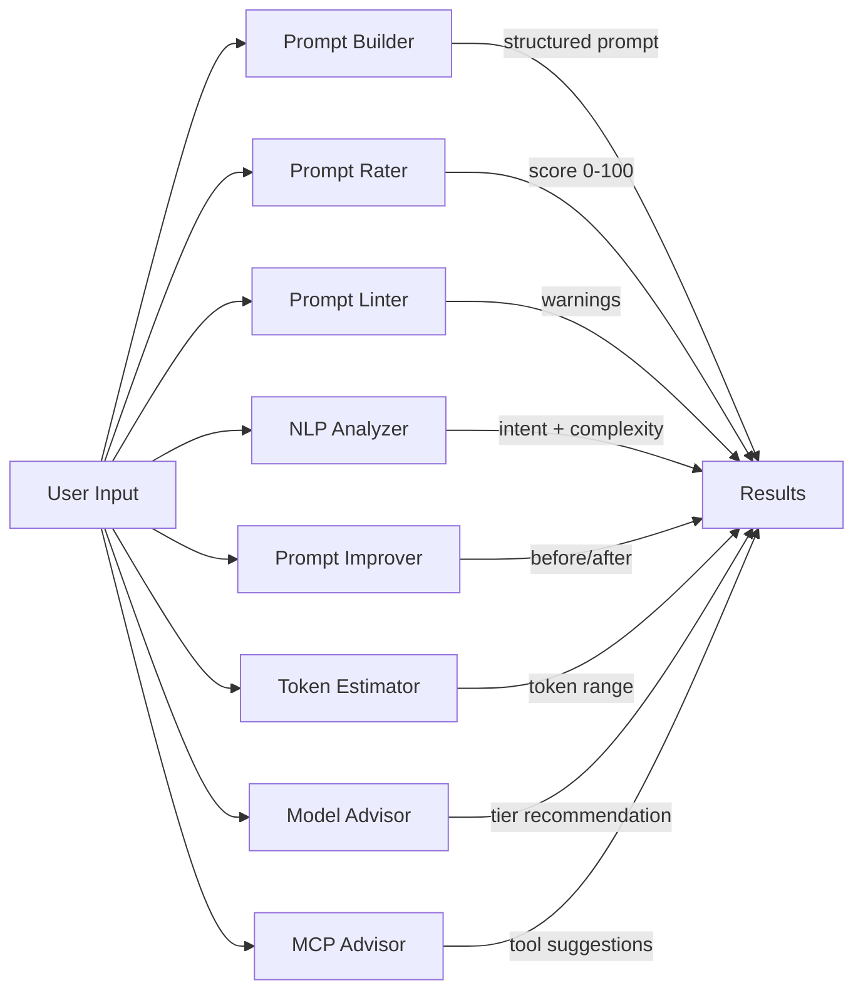
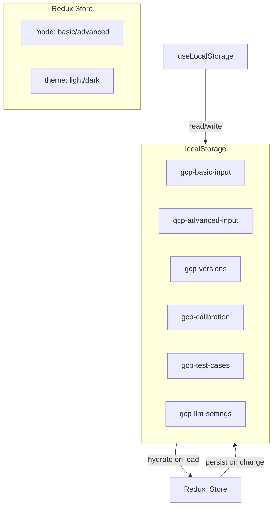
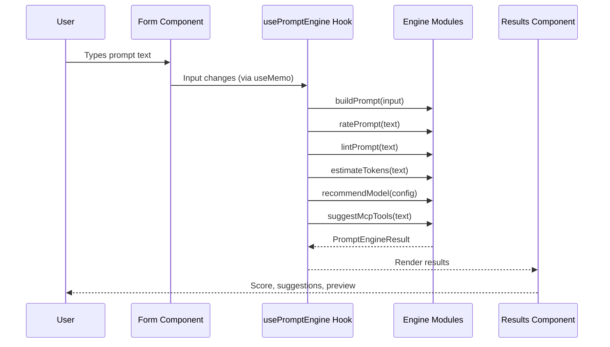
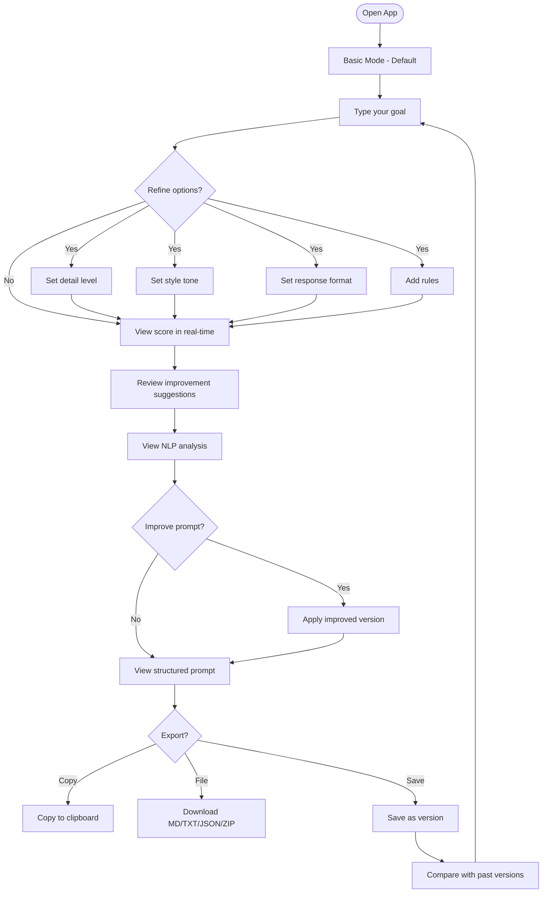
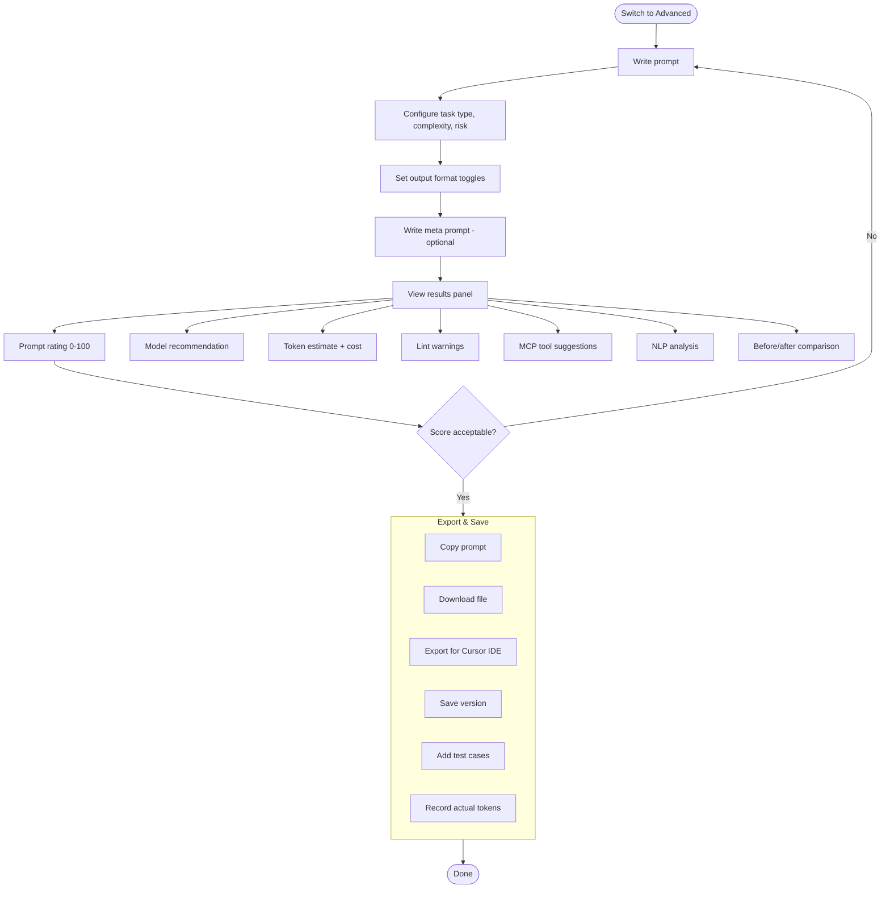

<p align="center">
  
</p>

<h1 align="center">Garry Clear Prompt</h1>

<p align="center">
  <strong>Write better prompts. Get better answers.</strong><br/>
  A local-first prompt quality analyzer, optimizer, and engineering workbench.
</p>

<p align="center">
  <a href="https://girijashankarj.github.io/garry-clear-prompt/"><strong>Live Demo</strong></a> &bull;
  <a href="#features">Features</a> &bull;
  <a href="#quick-start">Quick Start</a> &bull;
  <a href="#architecture">Architecture</a> &bull;
  <a href="#user-flows">User Flows</a> &bull;
  <a href="#scenarios">Scenarios</a> &bull;
  <a href="#tech-stack">Tech Stack</a> &bull;
  <a href="#contributing">Contributing</a> &bull;
  <a href="#license">License</a>
</p>

<p align="center">
  <a href="https://github.com/girijashankarj/garry-clear-prompt/actions/workflows/deploy.yml"></a>
  
  
  
  
  
</p>

---

## Why?

Most people write prompts like they write emails -- long, vague, and full of filler. The result? Unpredictable AI output, wasted tokens, and wasted time.

**Garry Clear Prompt** scores your prompt in real-time, shows you exactly what's wrong, rewrites it for you, and estimates how many tokens it'll cost -- all locally, with zero API calls.

---

## Features

### Core Engine

| Feature                            | Description                                                                                             |
| ---------------------------------- | ------------------------------------------------------------------------------------------------------- |
| **Prompt Rating**                  | Scores 0-100 across 5 dimensions: clarity, constraints, structure, token efficiency, risk penalty       |
| **Before/After Comparison**        | Auto-rewrites your prompt, shows score delta, one-click apply                                           |
| **Prompt Linter**                  | 15+ rules covering quality, security (PII, secrets, injection), and efficiency                          |
| **Prompt Improver**                | Strips filler, adds format instructions, length hints, optional domain checklist (`improve-intent`)     |
| **ML checklist refine (optional)** | Set `VITE_ML_INTENT_ENABLED=true` to re-classify the checklist in-browser (Transformers.js); no API key |
| **NLP Analysis**                   | Intent detection, complexity grading, Flesch-Kincaid readability, key noun/verb extraction              |

### Model & Token Intelligence

| Feature               | Description                                                                                |
| --------------------- | ------------------------------------------------------------------------------------------ |
| **Model Advisor**     | Recommends Fast/Balanced/Reasoning tier based on task type, complexity, risk, context size |
| **Token Estimator**   | Input/output token ranges with format multipliers (JSON +10%, code +50%, tables +20%)      |
| **Token Calibration** | Record actual usage to compute correction factors for future estimates                     |
| **Cost Preview**      | Pre-flight cost estimate per provider and model                                            |

### Productivity Tools

| Feature                 | Description                                                                       |
| ----------------------- | --------------------------------------------------------------------------------- |
| **Version History**     | Save v1/v2/v3 snapshots, restore any version, view score progression              |
| **Similar Prompts**     | Keyword-based Jaccard similarity search across your version history               |
| **Test Cases**          | Create test suites with input/expected-output pairs for offline validation        |
| **Multi-format Export** | Copy, Markdown, Text, JSON, ZIP bundle — timestamped filenames (DD_MM_YYYY_HH_MM) |
| **Cursor IDE Export**   | Export as `.mdc` rule, agent, skill, or command for Cursor IDE                    |

### Two Modes

| Mode         | Best For            | Includes                                                                                                                                 |
| ------------ | ------------------- | ---------------------------------------------------------------------------------------------------------------------------------------- |
| **Basic**    | Anyone who can type | Goal input, detail/style/format refiners, score, NLP, before/after, versioning                                                           |
| **Advanced** | Prompt engineers    | Everything in Basic + task config, model advisor, token estimator, lint, MCP advisor, calibration, test cases, Cursor export, LLM runner |

### Coming Soon

| Feature                      | Status                                                                 |
| ---------------------------- | ---------------------------------------------------------------------- |
| **LLM Runner**               | UI built, API disabled. OpenAI, Anthropic, AWS Bedrock adapters ready. |
| **Collaborative Editing**    | Planned                                                                |
| **Prompt Templates Library** | Planned                                                                |

---

## Quick Start

**Prerequisites**: Node.js >= 20.19 (recommended: v24.13.0), npm >= 10

```bash
# Clone the repo
git clone https://github.com/girijashankarj/garry-clear-prompt.git
cd garry-clear-prompt

# Install dependencies
npm install

# Copy environment config
cp .env.example .env

# Start development server
npm run dev
```

Open [http://localhost:5173](http://localhost:5173) in your browser.

Optional: enable in-browser ML checklist refinement in `.env` with `VITE_ML_INTENT_ENABLED=true` (see `.env.example`).

### Available Scripts

| Script                   | Description                              |
| ------------------------ | ---------------------------------------- |
| `npm run dev`            | Start Vite dev server with HMR           |
| `npm run build`          | TypeScript check + Vite production build |
| `npm run lint`           | ESLint check (zero warnings enforced)    |
| `npm run lint:fix`       | ESLint auto-fix                          |
| `npm run format`         | Prettier format all files                |
| `npm run format:check`   | Check formatting without changes         |
| `npm test`               | Jest with coverage                       |
| `npm run test:coverage`  | Same as test (with coverage report)      |
| `npm run test:structure` | Verify tests mirror src/ structure       |
| `npm run preview`        | Preview production build                 |

---

## Architecture

### High-Level Overview



### Component Architecture



### Engine Pipeline



### State Management



### Data Flow



---

## User Flows

### Basic Mode Flow



### Advanced Mode Flow



---

## Scenarios

### Scenario 1: First-Time User Writes a Better Prompt

> **Goal**: A non-technical user wants to ask ChatGPT to explain a concept.

1. Opens app (defaults to Basic Mode, dark theme)
2. Types: "tell me about React"
3. Sees a low score (30/100) with suggestions:
   - "Start with a clear action verb"
   - "Add output format: 'in bullet points'"
   - "Add a length limit"
4. Clicks "Apply" on the Before/After comparison
5. Prompt becomes: "Explain React. Provide the response in a clear, structured format. Keep the response concise."
6. Score jumps to 65/100
7. Adds detail level "Short" and style "Simple"
8. Copies the structured prompt to clipboard

### Scenario 2: Developer Optimizes a Complex Prompt

> **Goal**: A senior developer needs to write a production-quality prompt for code generation.

1. Switches to Advanced Mode
2. Writes a detailed prompt for a REST API migration
3. Sets: Task Type = Refactor, Complexity = High, Risk = High, Context = Large
4. Sees Model Advisor recommend "Reasoning" tier with high confidence
5. Token estimate shows 2,500-4,800 tokens (~$0.15 on Claude 4 Opus)
6. Lint catches: "No examples provided", "Missing audience"
7. Iterates until score reaches 85/100
8. Saves as v3, exports as Cursor Rule for team use

### Scenario 3: Team Standardizes Prompt Quality

> **Goal**: A team lead wants to ensure all team prompts meet a quality bar.

1. Opens Advanced Mode
2. Creates a test suite "API Documentation Prompts"
3. Adds 5 test cases with input/expected-output pairs
4. Each team member runs their prompts through the linter
5. Exports Cursor Rules (.mdc) for the team's shared `.cursor/rules/` folder
6. Pre-commit hooks catch prompts below score 60

### Scenario 4: Token Budget Optimization

> **Goal**: Reduce LLM costs by tracking and calibrating token estimates.

1. Writes a prompt, sees estimate: 400-700 input tokens
2. Runs it in ChatGPT, actual usage: 520 input tokens
3. Records actual usage in the Calibration panel
4. After 10 records, correction factor settles at 1.15x
5. Future estimates are automatically 15% more accurate
6. Cost preview adjusts accordingly

### Scenario 5: Cursor IDE Integration

> **Goal**: Export a well-crafted prompt as a Cursor IDE rule for persistent AI guidance.

1. Crafts a prompt for "Code Review Best Practices"
2. Score: 92/100
3. Opens Cursor Export panel
4. Types name: "Code Review Helper"
5. Selects "Rule (.mdc)"
6. Previews the generated `.mdc` file
7. Downloads and places in `.cursor/rules/`

---

## Rating Mechanism

5 dimensions, scored out of 100:

| Dimension        | Max | What It Checks                                                     |
| ---------------- | --- | ------------------------------------------------------------------ |
| Clarity          | 25  | Single clear goal, specific action verb, no vague language         |
| Constraints      | 20  | Output format, length limits, do/don't rules, scope boundaries     |
| Structure        | 20  | Labeled sections, bullet points, paragraphs, logical flow          |
| Token Efficiency | 20  | No filler words, no repetition, no conversational padding          |
| Risk Penalty     | -15 | Open-ended scope, multiple tasks, missing audience, contradictions |

**Score bands**: Excellent (90+), Good (75-89), Average (60-74), Weak (40-59), Poor (<40)

---

## Tech Stack

| Layer             | Technology                                             |
| ----------------- | ------------------------------------------------------ |
| **Framework**     | React 19 + TypeScript 5.9 (Node.js v24.13.0)           |
| **Build**         | Vite 7                                                 |
| **Styling**       | Tailwind CSS v4 + shadcn/ui (Radix primitives)         |
| **State**         | Redux Toolkit (app state) + localStorage (persistence) |
| **Forms**         | react-hook-form + zod                                  |
| **NLP**           | compromise (lightweight browser NLP)                   |
| **Export**        | JSZip, react-markdown + remark-gfm                     |
| **Notifications** | sonner                                                 |
| **Logging**       | Custom browser logger (structured JSON)                |
| **Testing**       | Jest + React Testing Library                           |
| **Linting**       | ESLint 9 (flat config) + Prettier                      |
| **Git Hooks**     | Husky + commitlint + lint-staged                       |
| **Versioning**    | Changesets                                             |

---

## Project Structure

```
garry-clear-prompt/
├── src/
│   ├── main.tsx                      # Entry point (Redux Provider)
│   ├── App.tsx                       # Root component
│   ├── common/                       # Constants, enums, types, messages, interfaces, fileNames
│   ├── store/                        # Redux Toolkit (promptSlice)
│   ├── utils/                        # loggerUtils, index
│   ├── hooks/                        # useLocalStorage, usePromptEngine
│   ├── types/                        # prompt.types.ts
│   ├── lib/
│   │   ├── engine/                   # Builder, Rater, Linter, Estimator, Advisor, NLP, Improver
│   │   ├── data/                     # Model tiers, MCP tools, lint rules, output multipliers
│   │   ├── exporters/                # Markdown, Text, JSON, ZIP, Cursor
│   │   └── llm/                      # Providers, adapter, settings (disabled)
│   └── components/
│       ├── ui/                       # 11 shadcn primitives
│       ├── layout/                   # Header, Footer
│       ├── basic-mode/               # BasicPromptForm, BasicResults
│       ├── advanced-mode/            # AdvancedPromptForm, AdvancedResults, + panels
│       └── shared/                   # ScoreBadge, InfoTooltip, CharCounter, ExportButtons, ...
├── tests/                            # Jest tests mirroring src/ structure
├── config/                           # client.json, env.json, theme.json
├── scripts/                          # verify-tests.js, precommit scripts
├── .cursor/                          # AI rules, agents, skills, commands, hooks
├── .env.example                      # Environment variable documentation
├── .github/                          # PR template, labeler, CI workflow
└── .husky/                           # pre-commit, commit-msg hooks
```

---

## Contributing

We welcome contributions! Here's how to get started:

### 1. Fork & Clone

```bash
git clone https://github.com/<your-username>/garry-clear-prompt.git
cd garry-clear-prompt
npm install
cp .env.example .env
```

### 2. Create a Branch

Follow the naming convention:

```bash
git checkout -b feature/your-feature-name
# or
git checkout -b fix/your-bug-fix
```

| Prefix               | Use For             |
| -------------------- | ------------------- |
| `feature/*`          | New features        |
| `fix/*`              | Bug fixes           |
| `hotfix/*`           | Production hotfixes |
| `release/DD-MM-YYYY` | Release branches    |

### 3. Make Changes

- Follow the existing code patterns (see `.cursor/rules/` for standards)
- Add info tooltips to any new form fields
- Add char count / char limit to any new text inputs
- Add structured logging via `loggerUtils` to new modules
- Use constants from `src/common/constants`
- Use message constants from `src/common/messages/` for all toast and log text — never hard-code strings
- Use `src/common/fileNames.ts` for export file-name constants
- Use `StorageResult<T>` / `ApiResult<T>` from `src/common/interfaces/` for typed returns

### 4. Write Tests

```bash
# Run tests
npm test

# Check that every src file has a test
npm run test:structure
```

- Tests live in `tests/src/` mirroring the `src/` directory (30 suites, 315 tests)
- Minimum 80% coverage required
- Use mock factories from `tests/mock/index.ts` (`createMockBasicInput`, `createMockAdvancedInput`, `createMockEngineResult`)

### 5. Commit

We use [Conventional Commits](https://www.conventionalcommits.org/):

```bash
# Create a changeset (required for all PRs)
npx changeset

# Commit with conventional format
git commit -m "feat: add prompt template library"
```

| Type       | When                                    |
| ---------- | --------------------------------------- |
| `feat`     | New feature                             |
| `fix`      | Bug fix                                 |
| `docs`     | Documentation only                      |
| `refactor` | Code change that neither fixes nor adds |
| `test`     | Adding or updating tests                |
| `chore`    | Build process, dependencies, CI         |

### 6. Pre-commit Checks

Husky runs these automatically:

1. Branch name validation
2. Changeset presence check
3. ESLint auto-fix
4. Prettier formatting
5. Test coverage check

### 7. Open a Pull Request

```bash
git push -u origin feature/your-feature-name
```

Then open a PR against `main`. Fill in the PR template.

### What We Look For in PRs

- [ ] Code follows project conventions (see `.cursor/rules/`)
- [ ] Tests added/updated for changes
- [ ] All tests pass (`npm test`)
- [ ] Lint passes (`npm run lint`)
- [ ] Format check passes (`npm run format:check`)
- [ ] Changeset created (`npx changeset`)
- [ ] No hardcoded secrets or PII
- [ ] Toast/log messages use constants from `src/common/messages/`
- [ ] Info tooltips added for new form fields
- [ ] Char counters added for new text inputs
- [ ] Accessibility: ARIA labels, keyboard navigation, color contrast

### Development Tips

- **Cursor IDE users**: The `.cursor/` directory has 10 AI rules, 4 agents, 2 skills, and 4 commands pre-configured for this project
- **VS Code users**: `.vscode/settings.json` and `.vscode/extensions.json` are included
- **New components**: Use `.cursor/templates/component.template` for scaffolding
- **New tests**: Use `.cursor/templates/test.template` for scaffolding

---

## Git Conventions

### Commit Format

```
feat: add prompt version comparison
fix: correct token estimation for JSON format
docs: update architecture diagram
refactor: extract rating dimensions to constants
test: add prompt-linter edge case tests
chore: update eslint config
```

### Changesets

Version management via changesets:

```bash
npx changeset          # Create a changeset
npx changeset version  # Apply version bumps
```

---

## Cursor IDE Configuration

This project includes a comprehensive `.cursor/` configuration:

| Category  | Count | Description                                           |
| --------- | ----- | ----------------------------------------------------- |
| Rules     | 10    | Architecture, frontend, testing, security standards   |
| Agents    | 4     | Performance, state, styling, UI component specialists |
| Skills    | 2     | Component creation, state management workflows        |
| Commands  | 4     | Test coverage, test single, audit deps, check secrets |
| Hooks     | 3     | Auto-format, post-edit check, shell guard             |
| Templates | 2     | Component and test scaffolding                        |

---

## Core Philosophy

> **Clarity before cleverness.** Structure before size. Constraints before creativity.

---

## License

MIT -- see [LICENSE](LICENSE) for details.

---

<p align="center">
  Made with care by <a href="https://github.com/girijashankarjambhale">@girijashankarjambhale</a>
</p>
