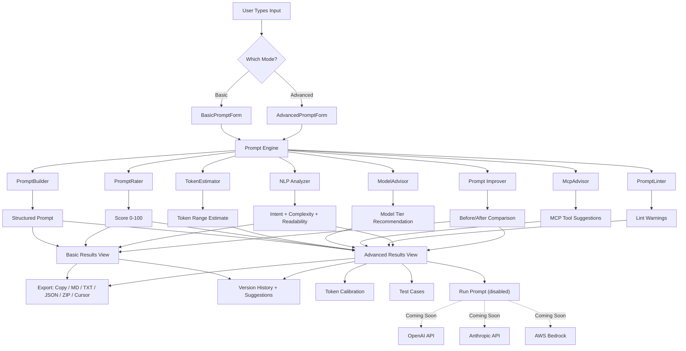

# Garry Clear Prompt

A standalone web app that helps **anyone who can type** write prompts that produce more accurate results using fewer words and fewer tokens. Two modes:

- **Basic Mode** (default): Natural language, no jargon, gentle refiners
- **Advanced Mode**: Full control -- model advisor, token estimation, prompt lint/rating, MCP suggestions, NLP analysis, calibration, versioning, test cases, and export

No backend. No auth. No database. Local-first. Offline-capable.

## What It Does

- **Rates your prompt** on 5 dimensions (clarity, constraints, structure, token efficiency, risk) with an animated score ring (0-100)
- **Suggests improvements** with actionable feedback
- **Before/After comparison** -- auto-rewrites your prompt and shows score improvement side-by-side with one-click apply
- **NLP analysis** -- detects intent (question/instruction/description/comparison), complexity level, readability grade, key nouns/verbs, and structural features using `compromise`
- **Recommends model tier** (Fast / Balanced / Reasoning) based on task type, complexity, and risk
- **Estimates token usage** with input/output token ranges and format multipliers
- **Calibration mode** -- record actual token usage to refine future estimates over time
- **Lints your prompt** with 15+ rules covering quality, security, and efficiency
- **Suggests MCP tools** with permission levels and risk notes
- **Prompt versioning** -- save v1/v2/v3 snapshots, restore, and compare across iterations
- **Similar prompt suggestions** -- surfaces related prompts from your version history using keyword similarity
- **Test cases** -- create test suites with input/expected-output pairs for offline prompt validation
- **Exports** to Markdown, Text, JSON, ZIP bundle, and Cursor IDE templates (rule, agent, skill, command)
- **Run Prompt** (coming soon) -- built-in LLM runner with OpenAI, Anthropic, and AWS Bedrock adapters, pre-flight cost estimates, run history, and total spend tracking. Currently disabled -- will be enabled when we have money to waste on tokens.

## Tech Stack

- **Vite + React 19 + TypeScript**
- **Tailwind CSS v4 + shadcn/ui** (Radix primitives)
- **react-hook-form + zod** (form handling + validation)
- **react-markdown + remark-gfm** (preview rendering)
- **compromise** (lightweight NLP for prompt analysis)
- **jszip** (ZIP bundle export)
- **sonner** (toast notifications for copy/export feedback)
- **localStorage** for draft persistence, versioning, calibration, and test cases (no DB)

## Project Structure

```
garry-clear-prompt/
├── index.html
├── package.json
├── tsconfig.json
├── vite.config.ts
├── components.json                  # shadcn config
├── public/
├── src/
│   ├── main.tsx
│   ├── App.tsx
│   ├── index.css                    # Tailwind base + theme variables
│   ├── components/
│   │   ├── ui/                      # shadcn primitives (button, card, input, etc.)
│   │   ├── layout/
│   │   │   ├── Header.tsx           # Logo, mode toggle (Basic/Advanced), theme toggle
│   │   │   └── Footer.tsx
│   │   ├── basic-mode/
│   │   │   ├── BasicPromptForm.tsx  # Main text input + gentle refiners
│   │   │   └── BasicResults.tsx     # Clean output + score + suggestions + NLP + versioning
│   │   ├── advanced-mode/
│   │   │   ├── AdvancedPromptForm.tsx  # Prompt + meta prompt editors
│   │   │   ├── ModelAdvisor.tsx     # Model tier recommendation
│   │   │   ├── TokenEstimator.tsx   # Input/output token range display
│   │   │   ├── PromptRating.tsx     # Full lint score breakdown
│   │   │   ├── McpAdvisor.tsx       # MCP tool suggestions
│   │   │   ├── LintWarnings.tsx     # Lint results panel
│   │   │   └── AdvancedResults.tsx  # Full output with all panels
│   │   └── shared/
│   │       ├── ScoreBadge.tsx       # Animated SVG score ring (0-100)
│   │       ├── ExportButtons.tsx    # Copy / Download .md / .txt / .json / .zip
│   │       ├── PromptPreview.tsx    # Rendered markdown preview
│   │       ├── ModeToggle.tsx       # Basic <-> Advanced switch
│   │       ├── ThemeToggle.tsx      # Dark/light theme switch
│   │       ├── BeforeAfterComparison.tsx  # Auto-rewrite with score diff
│   │       ├── NlpAnalysisPanel.tsx       # Intent, complexity, readability
│   │       ├── CalibrationPanel.tsx       # Record actual token usage
│   │       ├── VersionHistoryPanel.tsx    # Save/restore prompt versions
│   │       ├── PromptSuggestionsPanel.tsx # Similar prompts from history
│   │       ├── TestCasesPanel.tsx         # Input/expected output test suites
│   │       ├── CursorExportPanel.tsx      # Export as Cursor rule/agent/skill/command
│   │       └── LlmRunnerPanel.tsx         # Run prompt against LLM providers (disabled)
│   ├── lib/
│   │   ├── engine/
│   │   │   ├── prompt-builder.ts    # Structures raw input into clean prompt
│   │   │   ├── meta-prompt-builder.ts  # Generates meta prompt from inputs
│   │   │   ├── prompt-rater.ts      # Rating engine (clarity, constraints, structure, efficiency, risk)
│   │   │   ├── prompt-improver.ts   # Auto-rewrites prompt and computes before/after
│   │   │   ├── token-estimator.ts   # Input/output token range estimation
│   │   │   ├── model-advisor.ts     # Rule-based model tier recommendation
│   │   │   ├── mcp-advisor.ts       # Rule-based MCP tool suggestions
│   │   │   ├── prompt-linter.ts     # 15+ lint rules for prompt quality
│   │   │   └── nlp-analyzer.ts      # NLP analysis via compromise
│   │   ├── data/
│   │   │   ├── model-tiers.ts       # Model tier definitions + scoring matrix
│   │   │   ├── mcp-tools.ts         # MCP tool catalog + permissions
│   │   │   ├── lint-rules.ts        # Lint rule definitions
│   │   │   └── output-multipliers.ts  # Token output size multipliers
│   │   ├── exporters/
│   │   │   ├── markdown-exporter.ts
│   │   │   ├── text-exporter.ts
│   │   │   ├── json-exporter.ts
│   │   │   ├── zip-exporter.ts      # ZIP bundle with all files
│   │   │   └── cursor-exporter.ts   # Cursor rule/agent/skill/command templates
│   │   ├── llm/
│   │   │   ├── providers.ts         # Provider definitions (OpenAI, Anthropic, Bedrock)
│   │   │   ├── adapter.ts           # Unified run interface (stubbed, disabled)
│   │   │   └── settings.ts          # LLM settings + run history persistence
│   │   ├── calibration.ts           # Token calibration records + correction factors
│   │   ├── versioning.ts            # Prompt version history (v1/v2/v3)
│   │   ├── test-cases.ts            # Test suite management
│   │   ├── prompt-suggestions.ts    # Keyword-based similar prompt lookup
│   │   ├── storage.ts               # localStorage draft persistence
│   │   └── utils.ts                 # Clipboard, file download, cn() helpers
│   ├── hooks/
│   │   ├── use-prompt-engine.ts     # Main hook orchestrating all engine modules
│   │   ├── use-mode.ts              # Basic/Advanced mode state
│   │   └── use-local-storage.ts     # Generic localStorage hook
│   └── types/
│       └── prompt.types.ts          # All shared type definitions
└── README.md
```

## Architecture Flow



## Rating Mechanism (Core Differentiator)

5 dimensions, scored out of 100:

| Dimension        | Max Points | What It Checks                                       |
| ---------------- | ---------- | ---------------------------------------------------- |
| Clarity          | 25         | Single clear goal, unambiguous task                  |
| Constraints      | 20         | Output format, length limits, do/dont rules          |
| Structure        | 20         | Organized sections vs rambling text                  |
| Token Efficiency | 20         | No repetition, filler words, noise                   |
| Risk Penalty     | -15        | Open-ended wording, multiple tasks, missing audience |

Score bands: **Excellent** (90-100), **Good** (75-89), **Average** (60-74), **Weak** (40-59), **Poor** (below 40)

The animated SVG score ring counts up with an ease-out animation, color-coded by band.

## Model Advisor Logic

Rule-based scoring from user inputs (task type + complexity + risk + context size + tool needs):

- **Fast tier**: low risk, simple tasks (formatting, small edits)
- **Balanced tier**: most dev work (coding, moderate reasoning)
- **Reasoning tier**: high risk, complex (architecture, debugging, root cause)

## Token Estimator Logic

- Input tokens: `characters / 4` (English), shown as range `chars/5` to `chars/3`
- Output tokens: based on output size selector (XS/S/M/L/XL) + format multipliers (JSON +10%, code +30-80%, tables +20%, diagrams +50%, examples +40%)
- Always displayed as range with "Estimated" label
- **Calibration mode**: record actual usage to compute correction factors that refine future estimates

## NLP Analysis

Powered by `compromise`, detects:

- **Intent**: question, instruction, description, or comparison
- **Complexity**: simple, moderate, or complex
- **Readability**: Flesch-Kincaid grade level
- **Structural features**: lists, conditionals, negations
- **Key nouns and verbs** extracted from the prompt

## Before/After Comparison

Automatically rewrites your prompt by:

1. Stripping filler words and conversational padding ("please", "I want you to", "could you")
2. Adding output format instructions if missing
3. Adding length constraints if missing
4. Showing a side-by-side score comparison with the delta
5. One-click "Apply" to replace your prompt with the improved version

## Prompt Versioning

- Save your prompt as v1, v2, v3... (up to 50 versions in localStorage)
- Restore any previous version with one click
- View score history across versions
- **Similar prompt suggestions**: when you type, surfaces related prompts from your history using keyword-based Jaccard similarity

## Test Cases

- Create named test suites (e.g. "Email Generation Tests")
- Add up to 10 input/expected-output pairs per suite
- Track what your prompt should produce for specific inputs
- Export suites as JSON for sharing

## LLM Runner (Coming Soon)

Built-in prompt execution with a unified adapter layer across three providers. **Currently disabled** -- the UI is fully built but the Run button is locked.

| Provider     | Models                                      | Status   |
| ------------ | ------------------------------------------- | -------- |
| OpenAI       | GPT-4o mini, GPT-4o, o1, o3-mini           | Disabled |
| Anthropic    | Claude 3.5 Haiku, Claude 4 Sonnet, Claude 4 Opus | Disabled |
| AWS Bedrock  | Titan Text Express, Claude 3.5 Sonnet/Haiku | Disabled |

Features ready for when it's enabled:

- **Provider & model selector** with tier badges (fast/balanced/reasoning)
- **Pre-flight cost estimate** based on token estimate and model pricing
- **Settings panel** with credentials, temperature slider, max tokens
- **Run history** tracking runs, total spend, and tokens used
- **Security notice** -- API keys stored locally, never sent anywhere except directly to the provider

To enable: flip `LLM_FEATURE_ENABLED` to `true` in `src/lib/llm/adapter.ts` and implement the API calls.

## Export Options

| Format           | Description                                                           |
| ---------------- | --------------------------------------------------------------------- |
| Copy to Clipboard | One-click copy of structured prompt or meta prompt                   |
| Markdown (.md)   | Full analysis with score breakdown                                    |
| Plain Text (.txt)| Simple text export                                                    |
| JSON (.json)     | Machine-readable export of all data                                   |
| ZIP (.zip)       | Bundle: prompt.txt, meta-prompt.txt, analysis.md, config.json, report.md, lint warnings, MCP suggestions, README |
| Cursor Rule      | `.mdc` file for Cursor IDE rules                                      |
| Cursor Agent     | `.md` agent definition                                                |
| Cursor Skill     | `SKILL.md` step-by-step workflow                                      |
| Cursor Command   | Quick-action command snippet                                          |

## Key UI Decisions

- **Dark mode by default** with light mode toggle
- **Mode toggle** in header (Basic/Advanced) -- persisted in localStorage
- Basic Mode: single clean page, big input, friendly suggestions, NLP analysis, before/after comparison
- Advanced Mode: multi-panel layout with rating, model advisor, tokens, lint, MCP, calibration, NLP, versioning, test cases, and Cursor export
- Mobile responsive
- Animated score ring with counting animation and color-coded bands

## Getting Started

```bash
# Install dependencies
npm install

# Start development server
npm run dev

# Build for production
npm run build
```

## Core Philosophy

- Clarity before cleverness
- Structure before size
- Constraints before creativity

## License

MIT
