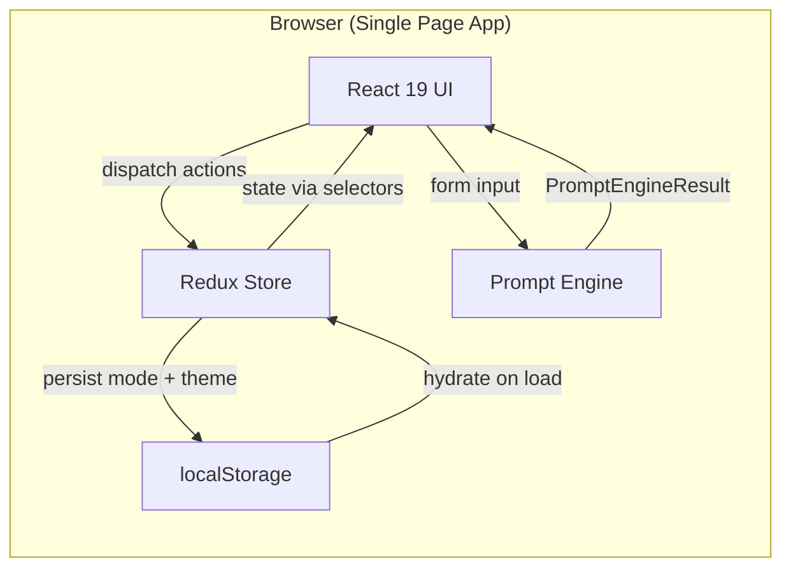
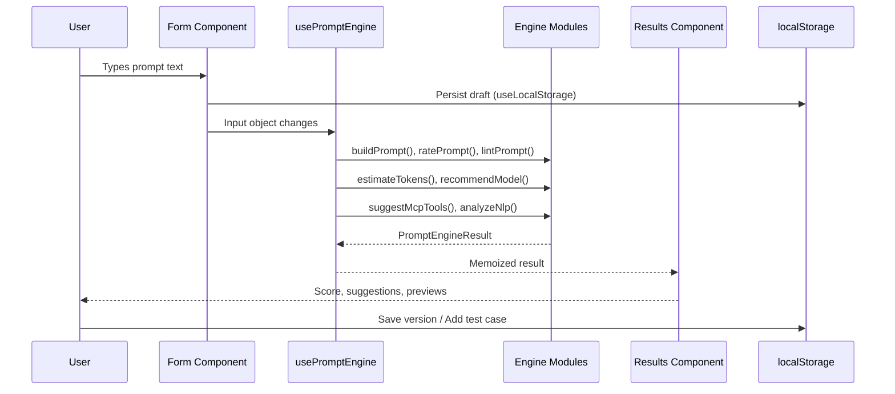

# Architecture

> How the pieces fit together.

---

## High-Level Overview



---

## Layer Architecture

```
┌─────────────────────────────────────────────────────┐
│                  Presentation Layer                  │
│   components/layout  components/basic-mode           │
│   components/advanced-mode  components/shared        │
│   components/ui (shadcn primitives)                  │
├─────────────────────────────────────────────────────┤
│                    State Layer                       │
│   store/promptSlice (Redux Toolkit)                  │
│   hooks/use-local-storage (persistence)              │
│   hooks/use-prompt-engine (derived state)             │
├─────────────────────────────────────────────────────┤
│                   Engine Layer                       │
│   lib/engine/prompt-builder                          │
│   lib/engine/prompt-rater                            │
│   lib/engine/prompt-linter                           │
│   lib/engine/prompt-improver                         │
│   lib/engine/token-estimator                         │
│   lib/engine/model-advisor                           │
│   lib/engine/mcp-advisor                             │
│   lib/engine/nlp-analyzer                            │
├─────────────────────────────────────────────────────┤
│                    Data Layer                        │
│   lib/data/model-tiers                               │
│   lib/data/lint-rules                                │
│   lib/data/mcp-tools                                 │
│   lib/data/output-multipliers                        │
├─────────────────────────────────────────────────────┤
│                  Export Layer                        │
│   lib/exporters/markdown  text  json  zip  cursor    │
├─────────────────────────────────────────────────────┤
│                 Infrastructure                       │
│   common/ (constants, enums, types, messages,        │
│           interfaces, fileNames, operations)          │
│   utils/loggerUtils (structured logging)             │
│   lib/storage  versioning  calibration  test-cases   │
└─────────────────────────────────────────────────────┘
```

---

## Data Flow



---

## State Management Strategy

| State Type                | Mechanism            | Scope          | Persistence            |
| ------------------------- | -------------------- | -------------- | ---------------------- |
| App mode (basic/advanced) | Redux Toolkit        | Global         | localStorage via slice |
| Theme (light/dark)        | Redux Toolkit        | Global         | localStorage via slice |
| Form input (basic)        | useLocalStorage hook | Component tree | localStorage           |
| Form input (advanced)     | useLocalStorage hook | Component tree | localStorage           |
| Engine results            | useMemo in hook      | Component tree | None (derived)         |
| Prompt versions           | Direct localStorage  | Feature        | localStorage           |
| Calibration records       | Direct localStorage  | Feature        | localStorage           |
| Test case suites          | Direct localStorage  | Feature        | localStorage           |
| LLM settings              | Direct localStorage  | Feature        | localStorage           |

---

## Engine Pipeline

Each engine module is a **pure function** (except NLP which uses `compromise`). They receive input and return a typed result. No side effects, no network calls.

```mermaid
flowchart TD
    Input[User Input] --> |text| Builder[Prompt Builder]
    Input --> |text| Rater[Prompt Rater]
    Input --> |text| Linter[Prompt Linter]
    Input --> |text| NLP[NLP Analyzer]
    Input --> |text| Improver[Prompt Improver]
    Input --> |text + config| TokenEst[Token Estimator]
    Input --> |config| ModelAdv[Model Advisor]
    Input --> |text| McpAdv[MCP Advisor]

    Builder --> |string| Result[PromptEngineResult]
    Rater --> |PromptRating| Result
    Linter --> |LintWarning[]| Result
    NLP --> |NlpAnalysis| Result
    Improver --> |PromptImprovement| Result
    TokenEst --> |TokenEstimate| Result
    ModelAdv --> |ModelRecommendation| Result
    McpAdv --> |McpToolSuggestion[]| Result
```

All engine modules emit structured log entries via `loggerUtils` for debugging.

---

## Directory Structure

```
src/
├── main.tsx                          # Entry: ReactDOM + Redux Provider
├── App.tsx                           # Root: Redux mode/theme, lazy Basic/Advanced + Suspense
├── common/                           # Shared infrastructure
│   ├── constants/index.ts            # APP_NAME, STORAGE_KEYS, SCORE_BANDS, limits
│   ├── enums/index.ts                # ThemeMode, PromptMode, DetailLevel, etc.
│   ├── types/index.ts                # Re-exports from prompt.types
│   ├── interfaces/index.ts           # ApiResult<T>, StorageResult<T>
│   ├── messages/                     # info, error, warn, debug message constants
│   ├── fileNames.ts                  # Export base names + extensions (FILE_NAMES, EXPORT_EXTENSIONS)
│   └── operations.ts                 # Operation name constants
├── store/                            # Redux Toolkit
│   ├── index.ts                      # configureStore, RootState, AppDispatch
│   └── promptSlice.ts                # mode + theme with localStorage sync
├── hooks/
│   ├── use-local-storage.ts          # Generic localStorage hook with SSR safety
│   └── use-prompt-engine.ts          # Memoized engine results for Basic + Advanced
├── types/
│   └── prompt.types.ts               # All shared TypeScript types
├── utils/
│   ├── loggerUtils.ts                # Browser-native structured JSON logger
│   └── index.ts                      # Barrel export
├── lib/
│   ├── engine/                       # Pure function engine modules
│   ├── data/                         # Static data (model tiers, lint rules, etc.)
│   ├── exporters/                    # Multi-format export functions
│   ├── ml/                           # Optional in-browser intent classifier (Transformers.js)
│   ├── llm/                          # LLM adapter layer (currently disabled)
│   ├── utils.ts                      # cn(), copyToClipboard(), downloadFile(), formatExportTimestamp(), getExportFileName()
│   ├── storage.ts                    # Draft save/load helpers
│   ├── versioning.ts                 # Prompt version CRUD
│   ├── calibration.ts                # Token calibration records
│   ├── test-cases.ts                 # Test suite CRUD
│   └── prompt-suggestions.ts         # Keyword similarity search
└── components/
    ├── ui/                           # 11 shadcn/ui primitives
    ├── layout/                       # Header, Footer
    ├── basic-mode/                   # BasicPromptForm, BasicResults
    ├── advanced-mode/                # AdvancedPromptForm, AdvancedResults, + 5 panels
    └── shared/                       # Shared UI (score, export, tabs, sticky score, loading skeleton, etc.)
```

---

## Key Design Decisions

1. **No backend** — Everything runs in the browser. localStorage for persistence. Zero API calls (until LLM runner is enabled).

2. **Pure engine functions** — All rating, linting, building, estimating modules are pure functions. Easy to test, no side effects.

3. **Redux for global state, localStorage for feature state** — Mode and theme are global concerns managed by Redux. Feature-specific data (versions, calibration, test cases) goes directly to localStorage.

4. **Memoized engine results** — `usePromptEngine` hooks use `useMemo` with specific dependency arrays to avoid re-computing engine results on unrelated state changes.

5. **Browser-native logging** — Replaced Winston with a lightweight custom logger to avoid Node.js module externalization warnings in Vite builds. Reduced bundle size by ~193KB.

6. **Constants centralization** — All magic strings, storage keys, limits, and app metadata live in `src/common/constants`. Toast / log messages use constants from `src/common/messages/`. Export file names use `src/common/fileNames.ts`. Storage and API functions return typed results (`StorageResult<T>`, `ApiResult<T>`) from `src/common/interfaces/`. No hardcoded values in components or engine modules.
